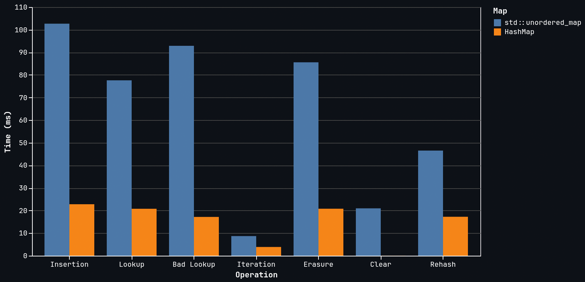
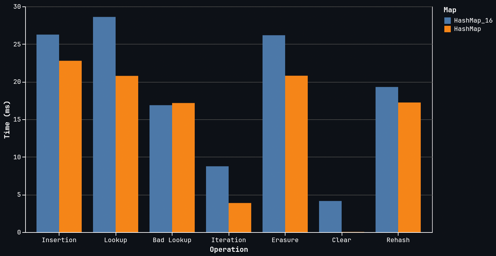

# HashMap

`HashMap` is an open-addressesed hash map written in C++ that offers dramatically improved performance over `std::unordered_map`. `<Key, Value>` pairs are stored densely in a contiguous array of raw memory `entries`, allowing for extremely fast iteration and immediate `Value` presence upon successful lookup. `Keys` hash into a separate, pre-initialized byte array `control` whose indices represent the status of a corresponding entry. Unoccupied indices hold values of `EMPTY = 0x80` and`TOMB = 0xFE`. Live indices hold a 7-bit `fingerprint` of the hashed `Key`. When performing lookups, `control` indices are 'cheaply validated' with a `fingerprint` comparison before attempting to fetch an entry to perform a more expensive `Key` comparison.

In order to allow `entries` to remain as dense as possible, an intermediate byte array `ctoe` (control-to-entry) is used to store and access the indices of entries. `ctoe` has a 1:1 correspondance with `control`. A separate byte array `etoc` (entry-to-control) is used for bookkeeping during entry deletion.

The capacity of `HashMap` must always be a power of 2. This allows hash indices to be determined by the extremely cheap operation `std::size_t index = hash & (capacity - 1)` as opposed to standard modular arithmetic.

`HashMap` implements a 'dual load factor' system. A rehash will occur when the number of live + `TOMB` entries exceeds 85% capacity, or when the number of `TOMB` entries exceeds 30% capacity.

## Benchmarks


`HashMap` was benchmarked against `std::unordered_map` under the following specifications:

    Iteration
    | time, in ms, to perform n unique insertion operations on a pre-allocated map

    Erase
    | time, in ms, to perform n unique erase operations on a map containing n entries

    Lookup
    | time, in ms, to perform n unique lookup operations on a map containing n entries

    Bad Lookup
    | time, in ms, to perform n unique lookup misses on a map containing n entries

    Iteration
    | time, in ms, to iterate over a map with n elements

    Rehash
    | time, in ms, to resize a map of size n to (2 * n)

    Clear
    | time, in ms, to clear all entries from a map containing n entries


    Compiled w/ g++ -std=c++20 -o3 -DNDEBUG

    <Key, Value> pairs are of type <std::uint64_t, std::uint64_t>.


    All values obtained from lookups or iteration are immediately used to
    prevent the compiler from discarding the operation.


    CPU: 13th Gen Intel(R) Core(TM) i9-13900K (16+16) @ 5.80HGz
    Memory: 32GB (31.1 GiB) DDR5

## Restrictions & Requirements

`HashMap` has multiple restrictions placed on its implementation and usage. There are many features of generic C++ containers I do not yet understand the mechanics of, and instead of implementing these haphazardly, I prefer a more stable implementation with light restrictions. Ultimately, these restrictions do not amount to much, and will not impact most use cases, but they're still worth mentioning.

- `Keys` and `Values` must be 'nothrow move constructible'
    - `HashMap` does not know how to handle exceptions that occur doing relocation.
    - This property is held by all trivial types and `structs` whose only members are trivial types. 

- `Values` must be 'default constructible'
    - `HashMap` stores entries in an array of bytes that remain uninitialized until an insertion takes place. In order to insert an entry, a reference to a default-constructed `Value` must be returned to perform the assignment.
    - This property is held by all trivial types and `structs` whose only members are trivial types.

- `Keys` must be 'noexcept hashable'
    - `HashMap` does not have a custom hashing algorithm for complex types and implements hashing via `std::hash`.
    - This property is held by all trivial types.

`HashMap` does not support custom memory allocators. This is a feature I was torn on implementing, but I ultimately do not trust my understanding of allocators enough to implement it as robustly as I would like.


## A Tangent: `HashMap_16`



I became inspired to work on `HashMap` while working on another project of mine, `ascii-terminal`. I needed a data structure with incredibly fast iteration & lookup time and didn't want to build a one-off container, so I decided to build a hash map that I would be able to reuse later.

` HashMap_16` was the result of my first attempt at creating a hash map. Instead of storing entries as densely as possible, it utilizes SIMD architecture (Single-Instruction, Multiple-Data) to process 16 `control` indices at a time. While this was still substantially faster than `std::unordered_map`, its iteration speed was almost identical, which was the main operation I was trying to improve. Additional testing led me to conclude that `control` indices are so fast to process that it was actually more expensive to prepare the SIMD group than to just process the indices sequentially. I assumed it would at least offer stronger results in maps that are more sparsely populated, but that is not the case. `std::unordered_map` iterates through itself by following a direct chain of pointers between `Nodes`. I realized the only way I was going to beat that speed was to iterate directly over entries stored in contiguous memory; which is exactly how `HashMap` is implemented.

In retrospect, it makes sense that the SIMD implementation is not as strong: `EMPTY` & `TOMB` indices differentiate themselves from live indices with the most significant bit. Assembling 16 bytes into a group would naturally be more expensive than what often boiled down to just 16 bit comparisons.

The techniques I learned from building `HashMap_16` alllowed me to hyper-optimize `HashMap`, so it wasn't a complete time sink. I'm including it here to document the progress I've made.


## New to HashMaps? Here's a Rundown

### `HashMap(std::size_t initial_capacity = 16)`

Constructs `HashMap` with a capacity equal to the minimum legal size that is greater than or equal to the provided argument. If no argument is provided, constructs `HashMap` with the minimum legal capacity (16).
```cpp
HashMap<int, int> a;      // capacity == 16

HashMap<int, int> b(64);  // capacity == 64

HashMap<int, int> c(26);  // capacity == std::bit_ceil(26) == 32

HashMap<int, int> d(8);   // capacity == 16
```
---

### `HashMap(const HashMap& other)`

Copy-constructs `HashMap` from another `HashMap`. The copied `HashMap` is a perfect duplicate and does not rehash upon initialization.
```cpp
HashMap<int, int> a;

// ...populate a

HashMap<int, int> b(a);  // b is a perfect copy of a
```
---

### `HashMap& operator=(const HashMap& other)`

Calls upon the copy constructor (above) to construct `HashMap` from another `HashMap`. Does not support cross-type assignment.
```cpp
HashMap<int, int> a;

// ...populate a

HashMap<int, int> b;

// ...populate b

a = b;  // a now contains all entries from b

HashMap<std::uint16_t, std::uint16_t> c;

c = a;  // error
```
---

### `Value& operator[](const Key& key)`

Returns a `Value` reference of the entry corresponding to the provided `Key`. Returns a default-constructed `Value` reference if the `Key` does not yet exist in `HashMap`.
```cpp
HashMap<int, int> hash_map;

hash_map[420] = 100;    // Default-constructs hash_map[420], assigns 100

int x = hash_map[420];  // x == 100
```
---

### `void clear()`

Clears all entries from a `HashMap` while preserving capacity.
```cpp
HashMap<int, int> hash_map;

// ...populate hash_map

hash_map.clear(); //hash_map is now empty
```
---

### `bool allocate(std::size_t cap)`

Attempts to resize `HashMap` to the bit ceiling of the provided argument. If the provided argument is smaller than the number of live entries, attempts to resize `HashMap` to the minimum legal capacity. Returns `true` if a resize occurs. Returns `false` otherwise.
```cpp
HashMap<int, int> hash_map(128);

// ...populate hash_map to 32 elements

hash_map.resize(32);    // too small, no resize occurs. returns false

hash_map.resize(50);    // resizes to std::bit_ceil(50) == 64

hash_map.resize(1024);  // resize can also be used to allocate space
```
---

### `bool shrink()`

Attempts to rresize `HashMap` to the minimum legal capacity. Returns `true` if a resize occurs. Returns `false` otherwise.
```cpp
HashMap<int, int> hash_map(256);

hash_map[420] = 100;  // capacity == 256 with only one element. waste of space

hash_map.shrink();    // capacity == 16
```
---

### `const Value& at(const Key& key)`

Returns a `const Value` reference corresponding to the provided `Key`. Throws `std::out_of_range` if no such `Key` is found.
```cpp
HashMap<int, int> hash_map;

int x = hash_map[420];  // x = default-constructed int

hash_map[420] = 100;

int y = hash_map.at(420);  // y == 100

int z = hash_map.at(421);  // throws std::out_of_range
```
---

### `bool contains(const Key& key)`

Returns `true` if `HashMap` has an entry corresponding to the provided `Key`. Returns `false` if not.
```cpp
HashMap<int, int> hash_map;

hash_map[420] = 100;

if (hash_map.contains(420)) {
    // This body will execute...
}

if (hash_map.contains(421)) {
    // ...but this body will not.
}
```
---

### `bool erase(const Key& key)`

Attempts to delete the entry corresponding to the provided `Key`. Returns `true` if a deletion occurred. Returns `false` if no deletion occurred (no such entry exists).
```cpp
HashMap<int, int> hash_map;

hash_map[420] = 100;

hash_map.erase(420);  // Returns true

hash_map.erase(421);  // Returns false
```
---

### `std::size_t size()`

Returns the currernt number of live entries in `HashMap`.
```cpp
HashMap<int, int> hash_map;

hash_map[420] = 100;
hash_map[421] = 50;

std::size_t x = hash_map.size();  // x = 2
```
---

### `std::size_t cap()`

Returns the current capacity of `HashMap`.
```cpp
HashMap<int, int> hash_map(128);

stds::size_t x = hash_map.cap();  // x == 128
```
### `bool empty()`

Returns `true` if `HashMap` contains no live entries. Returns `false` if `HashMap` contains `n > 0` live entries.
```cpp
HashMap<int, int> hash_map;

bool x = hash_map.empty();  // x == true

hash_map[420] = 100;

bool y = hash_map.empty();  // y == false
```
---

### Iteration

Iterating over `HashMap` works almost identically to iterating over `std::unordered_map`. The `Iterator` returns references to `EntryRef` objects containing a `const& Key` in `first` and a `&Value` in `second`. There is also a `ConstIterator` that returns `ConstEntryRefs` containing `const& Key` in `first` and `const& Value` in `second`.

```cpp
HashMap<int, int> hash_map;

// ...pupulate hash_map

int key_sum = 0;
int value_sum = 0;

for (auto entry : hash_map {
    key_sum += entry.first;     // Sums up all keys
    value_sum += entry.second;  // Sums up all values

    entry.second = 0;           // values can be modified directly. keys cannot
}

// There is also a const iterator

for (const auto entry : hash_map) {
    key_sum += entry.first;            
    value_sum += entry.second;        // all values == 0 now, remember?
}


```
